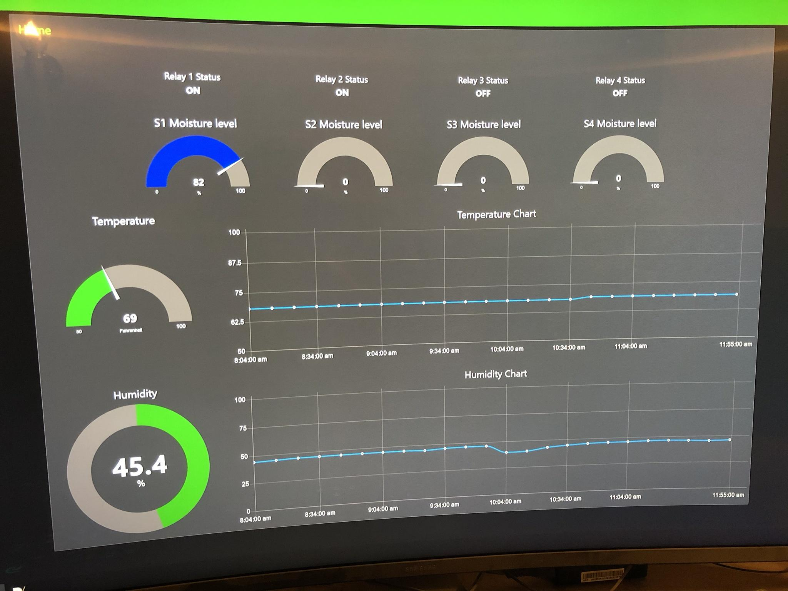
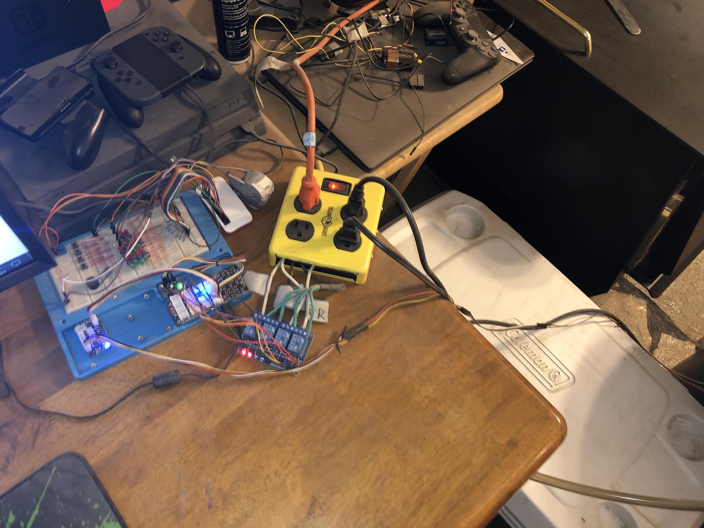
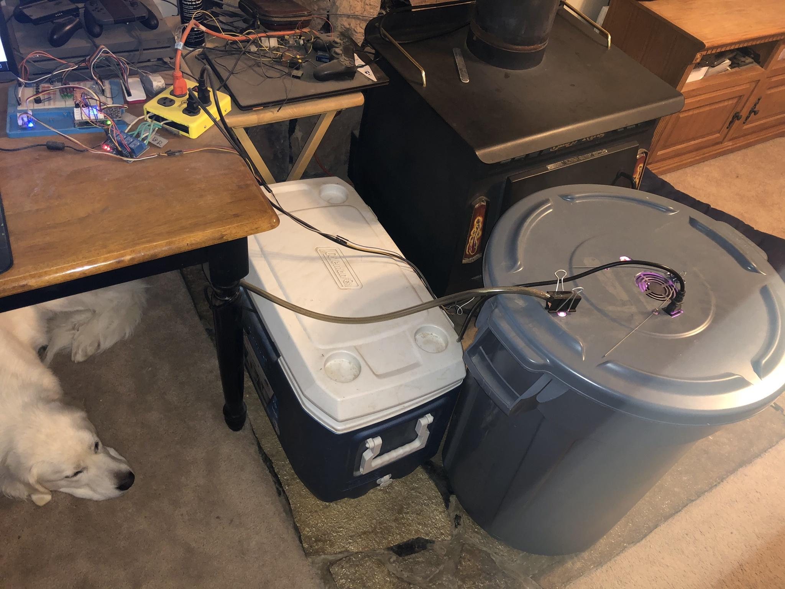
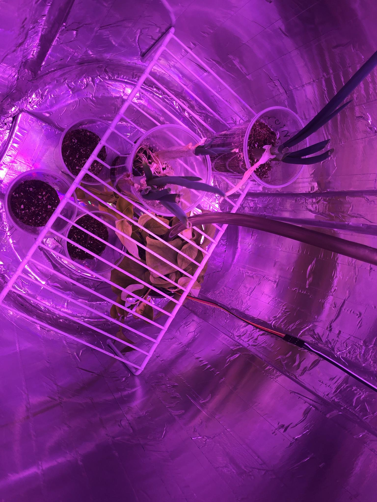

# IndoorAutoGarden
An ecosystem monitoring setup, ideal for growing plants indoors without user intervention.

# Functionality 
Automatically control and display metrics on a web dashboard such as: temperature, humidity, light, and soil moisture.

# Bill of Materials
SD card [16gb+]

Raspberry Pi Zero W [or any model with Wi-Fi][or a pre-built kit]
Kit examples (out of stock, sorry)
[https://www.amazon.com/dp/B072N3X39J]
[https://www.amazon.com/dp/B0748NK116]

Power supply [12v 2A][2 pack]
[https://www.amazon.com/dp/B077PW5JC3]

GPIO headers [10 pack]
[https://www.amazon.com/dp/B0756KM7CY]

UV led lighting
[https://www.amazon.com/dp/B07312WKX2]

Temp and humidity sensor
[https://www.amazon.com/dp/B01M0BJ139]

Capacitive soil moisture sensors
[https://www.amazon.com/dp/B07R174TM1]

Pump
[https://www.amazon.com/dp/B01CG2YE6K]

Analog-to-digital converter
[https://www.amazon.com/dp/B01FPZ1UXA]

Grove interface
[https://www.amazon.com/dp/B01FPU4JTM]

Jumper wires
[https://www.amazon.com/dp/B01EV70C78]

4 Channel relay module
[https://www.amazon.com/dp/B00KTEN3TM]

4 Outlet extension cord
[https://www.amazon.com/dp/B000HJBE0E]

Support local businesses, find the below parts locally if you can.
Solder, Vinyl tubing [size for pump], Reflective tape, Metal tape, Duct tape, Trash bucket.

## ALTERNATIVE/OPTIONAL PARTS LIST
UV led lighting
[https://www.amazon.com/dp/B077YK18TP]
[https://www.amazon.com/dp/B07VRPCBRL]

Temp and humidity sensor
[https://www.amazon.com/dp/B00NAY35SC]

Capacitive soil moisture sensors
[https://www.amazon.com/dp/B07SYBSHGX]

Light sensor
[https://www.amazon.com/dp/B00XW2OFWW]

Light strip for sides
[https://www.amazon.com/dp/B01D2CUNQ8]

4 channel relay module
[https://www.amazon.com/dp/B00E0NSORY]

## Images

